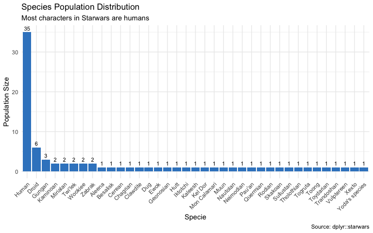
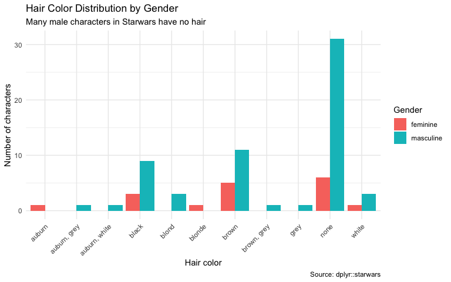
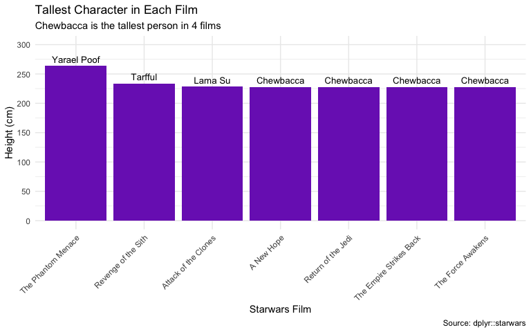
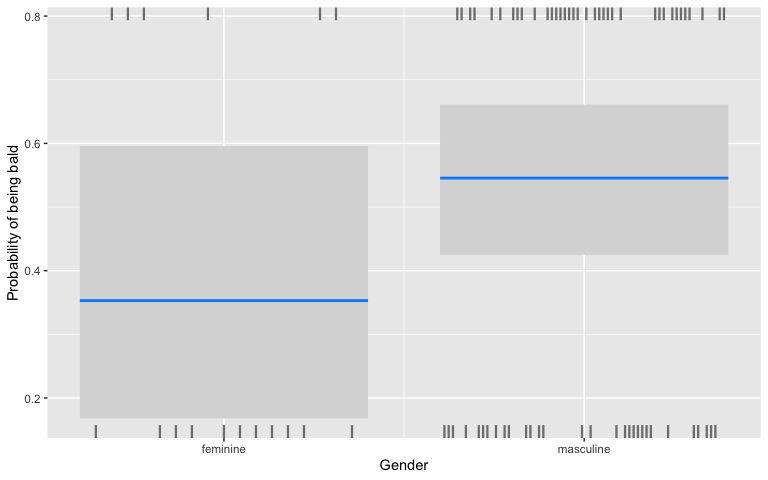

Starwars Character Characterization and Demographics
================
Richie Peng

# Project Introduction

本 Side Project 是一份基於 R 與 `starwars` dataset 的 data analysis side
project。以下分析涵蓋了從 **data exploration、data cleaning、descriptive
statistics visualization、advanced data manipulation，到 statistical
inference 與 modeling（linear regression 與 logistic
regression）**的流程，藉由 Starwars
的各個角色與數據由不同角度切入與分析。

### Key Findings & Takeaways

- **Data Exploration &
  Cleaning**：成功過濾多重條件樣本（如高齡非黑髮角色），並將複雜多樣的物種結構進行二元特徵工程（`Human`
  vs. `Non-human`），發現人類角色在星戰宇宙中佔據最高比例。
- **Advanced Data Manipulation**：運用 `lapply` 與 `do.call`
  解構列表型欄位（List-column），自動化萃取出各部電影的身高代表（如
  Chewbacca 在其中 4 部作品中名列最高）。
- **Modeling & Statistical Insights**：
  - **Outlier 診斷**：在體重與身高的線性迴歸中，識別出極端值（Jabba the
    Hutt，1,358
    kg）對模型配適度的嚴重干擾；排除異常值後，體重對身高展現出極顯著的正面預測力（$p < 0.001$）。
  - **多元迴歸與控制變數**：在控制性別變數的情況下，體重每增加 1
    公斤，預測身高平均增加約 1.05
    公分，且男性在同等體重下平均身高顯著低於女性角色。
  - **二元機率預估**：透過 Logistic Regression 與 `visreg`
    視覺化驗證，男性角色在生理特徵上呈現顯著高於女性的禿頭（無毛髮）預測機率。

------------------------------------------------------------------------

# 1. Data Exploration

在深入分析前，首先對 dataset 進行初步探索，抓取特定條件的樣本。

## Q1.尋找 extreme values 與條件 mean

**在 `starwars` dataset 中，找出 `mass` 最輕的 character 姓名與其 `mass`
數值；並針對 `height` 大於 150 cm 的 character，計算其 `mean`
`mass`（須排除 missing values `NA`）。**

``` r
# 1. 找出體重最輕角色的質量與其姓名
lightest_character <- starwars[which.min(starwars$mass), c("name", "mass")]
print("體重最輕的 character：")
```

    ## [1] "體重最輕的 character："

``` r
print(lightest_character)
```

    ## # A tibble: 1 × 2
    ##   name          mass
    ##   <chr>        <dbl>
    ## 1 Ratts Tyerel    15

``` r
# 2. 針對身高大於 150 cm 的角色，計算其平均體重
mean_mass_above_150 <- mean(starwars$mass[starwars$height > 150], na.rm = TRUE)
cat("\n身高大於 150 cm character 的平均體重為：", round(mean_mass_above_150, 2), "kg\n")
```

    ## 
    ## 身高大於 150 cm character 的平均體重為： 107.67 kg

------------------------------------------------------------------------

## Q2. 多重條件下針對特定族群選取

**篩選出 `birth_year` 大於 50 歲、`mass` 大於 45
公斤，且頭髮不是黑色的特定 character
族群，並匯出僅包含姓名、年齡、體重與髮色的 `data.frame`。**

``` r
# 設定 row 與 column 的篩選條件變數
rows <- which(starwars$birth_year > 50 & 
              starwars$mass > 45 & 
              starwars$hair_color != "black")

cols <- c("name", "birth_year", "mass", "hair_color")

# 進行資料選取
filtered_characters <- starwars[rows, cols]
knitr::kable(filtered_characters, caption = "符合篩選條件的 character 名單")
```

| name           | birth_year | mass | hair_color    |
|:---------------|-----------:|-----:|:--------------|
| Owen Lars      |         52 |  120 | brown, grey   |
| Obi-Wan Kenobi |         57 |   77 | auburn, white |
| Chewbacca      |        200 |  112 | brown         |
| Palpatine      |         82 |   75 | grey          |
| Bossk          |         53 |  113 | none          |
| Qui-Gon Jinn   |         92 |   89 | brown         |
| Jar Jar Binks  |         52 |   66 | none          |
| Darth Maul     |         54 |   80 | none          |
| Mace Windu     |         72 |   84 | none          |
| Ki-Adi-Mundi   |         92 |   82 | white         |
| Dooku          |        102 |   80 | white         |

符合篩選條件的 character 名單

------------------------------------------------------------------------

# 2. Data Cleaning & Feature Engineering

data 往往包含 missing values 與繁雜的類別，在此階段我們進行 column
歸併與特徵轉換。

## Q3. 將 species 歸併並針對電影期別進行標記

**1. 將 `species` column 進行 binary variables 的 feature
engineering：如果是人類則歸類為 `"Human"`，其餘所有非人類物種（包含
`NA`）皆歸類為 `"Non-human"`。**

**2. 建立新 column `early_films`：標記 character 是否演過《A New
Hope》或《The Empire Strikes Back》。**

``` r
# 複製一份乾淨的 data.frame 進行清理
starwars_clean <- starwars

# 1. 物種二元分類
starwars_clean$human <- ifelse(starwars_clean$species != "Human" | is.na(starwars_clean$species), 
                               "Non-human", "Human")
cat("物種歸併後的人數統計：\n")
```

    ## 物種歸併後的人數統計：

``` r
print(table(starwars_clean$human))
```

    ## 
    ##     Human Non-human 
    ##        35        52

``` r
# 2. 電影期別標記 (是否有演過電影 "A New Hope" 與 "The Empire Strikes Back")
starwars_clean$early_films <- grepl("A New Hope", starwars_clean$films) | 
                             grepl("The Empire Strikes Back", starwars_clean$films)
cat("演過這些電影的人數統計：")
```

    ## 演過這些電影的人數統計：

``` r
print(table(starwars_clean$early_films))
```

    ## 
    ## FALSE  TRUE 
    ##    62    25

------------------------------------------------------------------------

# 3. Descriptive Visualization

透過 plot 將 feature engineering 與清理後的 data 呈現出來，觀察
variables 間的分布關係。

## Q4. 繪製各 species 的數量分布 plot

**計算各 species 的出現數量並繪製 bar
chart，要求柱子由大到小排序、在柱子上方標註實際數量，且將 X 軸標籤旋轉
45 度以防文字重疊。**

``` r
# 計算各 species 出現數量並轉換為 data.frame
specie_counts <- as.data.frame(table(starwars_clean$species))
colnames(specie_counts) <- c("Specie", "Count")

# 繪製長條圖
ggplot(specie_counts, aes(x = reorder(Specie, -Count), y = Count)) +
  geom_bar(stat = "identity", fill = "#3a86c8") +
  geom_text(aes(label = Count), vjust = -0.5, size = 3) +
  theme_minimal() +
  theme(axis.text.x = element_text(angle = 45, hjust = 1, vjust = 1)) +
  labs(title = "Species Population Distribution",
       subtitle = "Most characters in Starwars are humans",
       x = "Specie",
       y = "Population Size",
       caption = "Source: dplyr::starwars")
```

<!-- -->

------------------------------------------------------------------------

## Q5. gender 與 hair color 的並排分布

**探討不同 gender（男性 vs. 女性）在各個 hair color
上的數量分布差異，並以並排 bar chart (`dodge`) 呈現。**

``` r
# 篩選出 gender 為 masculine 與 feminine 的 data 以利比較，並建立 hair color 與 gender 交叉表
gender_subset <- starwars_clean[starwars_clean$gender %in% c("masculine", "feminine"), ]
hair_gender <- as.data.frame(table(gender_subset$hair_color, gender_subset$gender))
colnames(hair_gender) <- c("Hair_Color", "Gender", "Freq")

# 繪製並排長條圖
ggplot(hair_gender, aes(x = Hair_Color, y = Freq, fill = Gender)) +
  geom_bar(stat = "identity", position = "dodge") +
  theme_minimal() +
  theme(axis.text.x = element_text(angle = 45, hjust = 1, vjust = 1)) +
  labs(title = "Hair Color Distribution by Gender",
       subtitle = "Many male characters in Starwars have no hair",
       x = "Hair color",
       y = "Number of characters",
       caption = "Source: dplyr::starwars")
```

<!-- -->

------------------------------------------------------------------------

# 4. Advanced Data Manipulation

主要專注在如何解開複雜結構的 data（如 list 欄位），並自動化整合分析。

## Q6. 自動化檢索每部星戰電影中最高的 height 代表

**由於 `films` column 在 data.frame 中屬於複雜的 list
結構，需設計一套自動化整合流程（不使用手動個別篩選），利用
`lapply`、`do.call` 與 `rbind` 提取出每部電影中 height 最高的 character
姓名與 height，並產出排序後的 data.frame 與 plot。**

``` r
# 1. 萃取出所有不重複的電影名稱清單
films_list <- names(table(unlist(starwars_clean$films)))

# 2. 利用 lapply 與 do.call 自動化找出每部電影中最高的角色
plotdata_tallest <- do.call(rbind, lapply(films_list, function(f) {
  film_chars <- starwars_clean[which(grepl(f, starwars_clean$films)), ]
  tallest_char <- film_chars[which.max(film_chars$height), ]
  data.frame(Film = f, Height = tallest_char$height, Name = tallest_char$name)
}))

# 顯示整理好的 data.frame
knitr::kable(plotdata_tallest, caption = "每部星戰電影中的最高 character 代表")
```

| Film                    | Height | Name        |
|:------------------------|-------:|:------------|
| A New Hope              |    228 | Chewbacca   |
| Attack of the Clones    |    229 | Lama Su     |
| Return of the Jedi      |    228 | Chewbacca   |
| Revenge of the Sith     |    234 | Tarfful     |
| The Empire Strikes Back |    228 | Chewbacca   |
| The Force Awakens       |    228 | Chewbacca   |
| The Phantom Menace      |    264 | Yarael Poof |

每部星戰電影中的最高 character 代表

``` r
# 3. 繪製各電影最高 character 與身高排序圖
ggplot(plotdata_tallest, aes(x = reorder(Film, -Height), y = Height)) +
  geom_bar(stat = "identity", fill = "#7b2cbf") +
  geom_text(aes(label = Name), vjust = -0.5, size = 3.5) +
  scale_y_continuous(limits = c(0, 300), breaks = seq(0, 300, 50)) +
  theme_minimal() +
  theme(axis.text.x = element_text(angle = 45, hjust = 1, vjust = 1)) +
  labs(title = "Tallest Character in Each Film",
       subtitle = "Chewbacca is the tallest person in 4 films",
       x = "Starwars Film",
       y = "Height (cm)",
       caption = "Source: dplyr::starwars")
```

<!-- -->

------------------------------------------------------------------------

# 5. Statistical Inference & Modeling

建立 regression model 來驗證 variables 之間的關係與進行預測。

## Q7. gender 對 height 的顯著性差異分析

**建立 linear regression 模型，檢定不同 gender（男性 vs. 女性）在 height
上是否具有統計學上的顯著差異，並解讀 model 分析報告中的 p-value。**

``` r
# 1. 描述性統計：觀測 gender 與 height 的 mean 差異
cat("男女平均身高：\n")
```

    ## 男女平均身高：

``` r
print(aggregate(height ~ gender, starwars_clean, mean))
```

    ##      gender   height
    ## 1  feminine 166.5333
    ## 2 masculine 176.5323

``` r
# 2. 建立簡單線性迴歸模型
model_gender_height <- lm(height ~ gender, data = starwars_clean)
summary(model_gender_height)
```

    ## 
    ## Call:
    ## lm(formula = height ~ gender, data = starwars_clean)
    ## 
    ## Residuals:
    ##      Min       1Q   Median       3Q      Max 
    ## -110.532   -4.532    6.468   16.468   87.468 
    ## 
    ## Coefficients:
    ##                 Estimate Std. Error t value Pr(>|t|)    
    ## (Intercept)      166.533      9.193  18.115   <2e-16 ***
    ## gendermasculine    9.999     10.245   0.976    0.332    
    ## ---
    ## Signif. codes:  0 '***' 0.001 '**' 0.01 '*' 0.05 '.' 0.1 ' ' 1
    ## 
    ## Residual standard error: 35.6 on 75 degrees of freedom
    ##   (10 observations deleted due to missingness)
    ## Multiple R-squared:  0.01254,    Adjusted R-squared:  -0.0006243 
    ## F-statistic: 0.9526 on 1 and 75 DF,  p-value: 0.3322

------------------------------------------------------------------------

## Q8. mass 與 height 的線性關係與 outlier 影響評估

**建立體重對身高的 linear regression 模型，識別出影響 model 顯著性的
outlier（例如 Jabba the Hutt），並評估排除 outlier 前後對 model
預測力與顯著性（p-value 與 R-squared）的劇烈變化。**

``` r
# 1. 原始模型 (包含體重 1358kg 的極端異常值 Jabba the Hutt)
model_with_outlier <- lm(height ~ mass, data = starwars_clean)
cat("--- 包含極端值模型成果 ---")
```

    ## --- 包含極端值模型成果 ---

``` r
summary(model_with_outlier)
```

    ## 
    ## Call:
    ## lm(formula = height ~ mass, data = starwars_clean)
    ## 
    ## Residuals:
    ##      Min       1Q   Median       3Q      Max 
    ## -106.152   -4.497    6.119   17.858   58.582 
    ## 
    ## Coefficients:
    ##              Estimate Std. Error t value Pr(>|t|)    
    ## (Intercept) 171.68547    5.34677  32.110   <2e-16 ***
    ## mass          0.02744    0.02754   0.997    0.323    
    ## ---
    ## Signif. codes:  0 '***' 0.001 '**' 0.01 '*' 0.05 '.' 0.1 ' ' 1
    ## 
    ## Residual standard error: 35.54 on 57 degrees of freedom
    ##   (28 observations deleted due to missingness)
    ## Multiple R-squared:  0.01712,    Adjusted R-squared:  -0.0001194 
    ## F-statistic: 0.9931 on 1 and 57 DF,  p-value: 0.3232

``` r
# 2. 資料清洗：排除 outlier (只保留體重小於 1000kg 的角色)
plotdata_no_outlier <- starwars_clean[which(starwars_clean$mass < 1000), ]

# 3. 排除 outlier 後重新建模
model_no_outlier <- lm(height ~ mass, data = plotdata_no_outlier)
cat("\n--- 排除極端值模型成果 ---")
```

    ## 
    ## --- 排除極端值模型成果 ---

``` r
summary(model_no_outlier)
```

    ## 
    ## Call:
    ## lm(formula = height ~ mass, data = plotdata_no_outlier)
    ## 
    ## Residuals:
    ##     Min      1Q  Median      3Q     Max 
    ## -54.448  -7.234   1.784  13.259  44.028 
    ## 
    ## Coefficients:
    ##             Estimate Std. Error t value Pr(>|t|)    
    ## (Intercept) 104.8056     8.7549  11.971  < 2e-16 ***
    ## mass          0.9201     0.1082   8.508 1.14e-11 ***
    ## ---
    ## Signif. codes:  0 '***' 0.001 '**' 0.01 '*' 0.05 '.' 0.1 ' ' 1
    ## 
    ## Residual standard error: 23.89 on 56 degrees of freedom
    ## Multiple R-squared:  0.5638, Adjusted R-squared:  0.556 
    ## F-statistic: 72.38 on 1 and 56 DF,  p-value: 1.138e-11

------------------------------------------------------------------------

## Q9. 控制 variables 下的關係估計

**建立 multiple regression 模型，在控制 gender 變數的影響下，評估 mass
對 height 的獨立解釋力，並解讀當 mass 每增加 1 公斤時預測 height
的變化。**

``` r
# 在控制性別變數的影響下，評估體重對身高的解釋力
model_multiple <- lm(height ~ mass + gender, data = plotdata_no_outlier)
summary(model_multiple)
```

    ## 
    ## Call:
    ## lm(formula = height ~ mass + gender, data = plotdata_no_outlier)
    ## 
    ## Residuals:
    ##     Min      1Q  Median      3Q     Max 
    ## -44.547  -9.741   2.867   9.832  51.313 
    ## 
    ## Coefficients:
    ##                 Estimate Std. Error t value Pr(>|t|)    
    ## (Intercept)     114.3149     9.6884  11.799 2.54e-16 ***
    ## mass              1.0467     0.1106   9.466 6.69e-13 ***
    ## gendermasculine -22.8676     8.7130  -2.625   0.0114 *  
    ## ---
    ## Signif. codes:  0 '***' 0.001 '**' 0.01 '*' 0.05 '.' 0.1 ' ' 1
    ## 
    ## Residual standard error: 22.71 on 52 degrees of freedom
    ##   (3 observations deleted due to missingness)
    ## Multiple R-squared:  0.6331, Adjusted R-squared:  0.619 
    ## F-statistic: 44.86 on 2 and 52 DF,  p-value: 4.774e-12

------------------------------------------------------------------------

## Q10. gender 對生理特徵的機率預估

**當目標變數為 binary variables（例如：是否禿頭 `IsBald`）時，建立
logistic regression 模型分析 gender 對禿頭機率的影響，並使用 `visreg`
繪製控制其他條件下的預測機率變化曲線圖。**

``` r
# 1. 建立二元變數 IsBald (有無頭髮)
starwars_clean$IsBald <- ifelse(starwars_clean$hair_color == "none" | is.na(starwars_clean$hair_color), TRUE, FALSE)

# 2. 建立邏輯迴歸模型 (glm)
model_logistic <- glm(IsBald ~ gender, data = starwars_clean, family = binomial(link = "logit"))
summary(model_logistic)
```

    ## 
    ## Call:
    ## glm(formula = IsBald ~ gender, family = binomial(link = "logit"), 
    ##     data = starwars_clean)
    ## 
    ## Coefficients:
    ##                 Estimate Std. Error z value Pr(>|z|)
    ## (Intercept)      -0.6061     0.5075  -1.194    0.232
    ## gendermasculine   0.7885     0.5645   1.397    0.163
    ## 
    ## (Dispersion parameter for binomial family taken to be 1)
    ## 
    ##     Null deviance: 115.05  on 82  degrees of freedom
    ## Residual deviance: 113.02  on 81  degrees of freedom
    ##   (4 observations deleted due to missingness)
    ## AIC: 117.02
    ## 
    ## Number of Fisher Scoring iterations: 4

``` r
# 3. 繪製控制條件下的預測機率變化圖
visreg(model_logistic, "gender", scale = "response", gg = TRUE, 
       ylab = "Probability of being bald", xlab = "Gender")
```

<!-- -->
